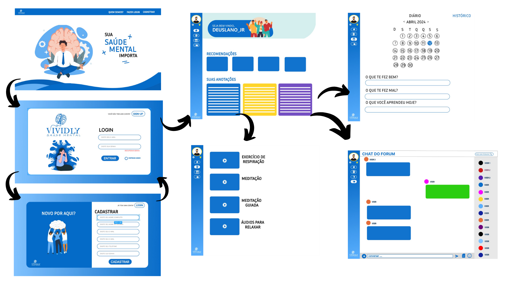
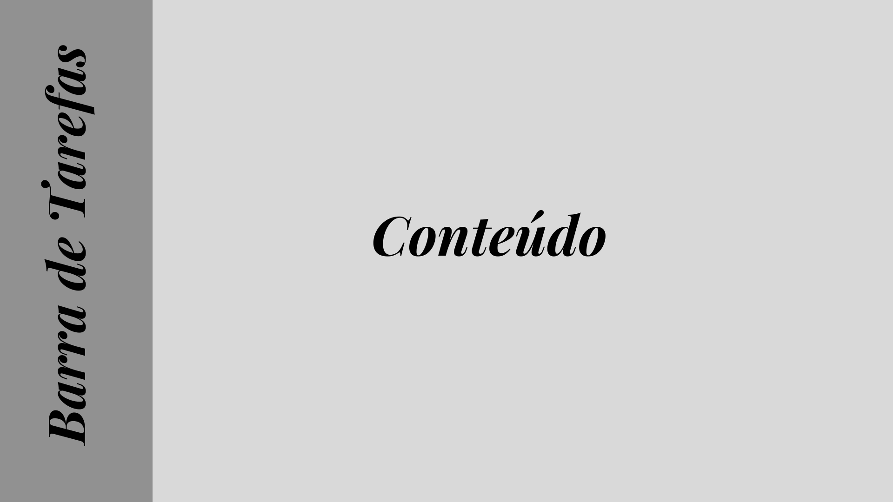
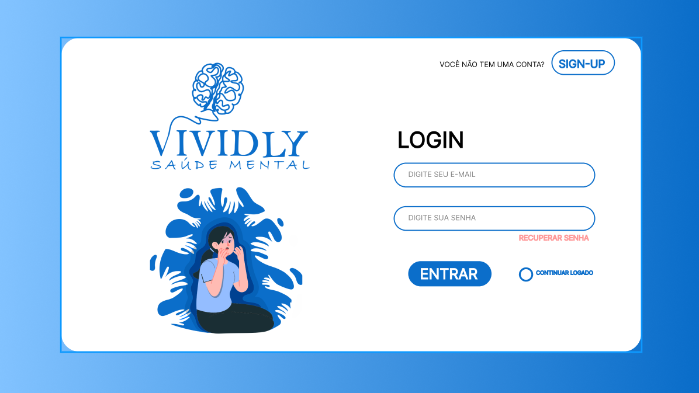
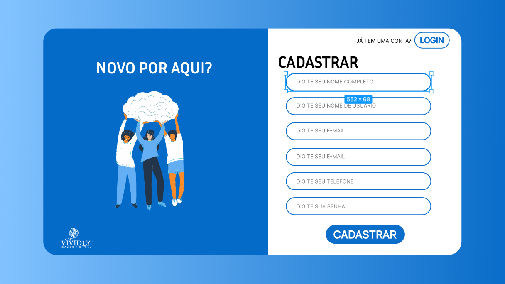
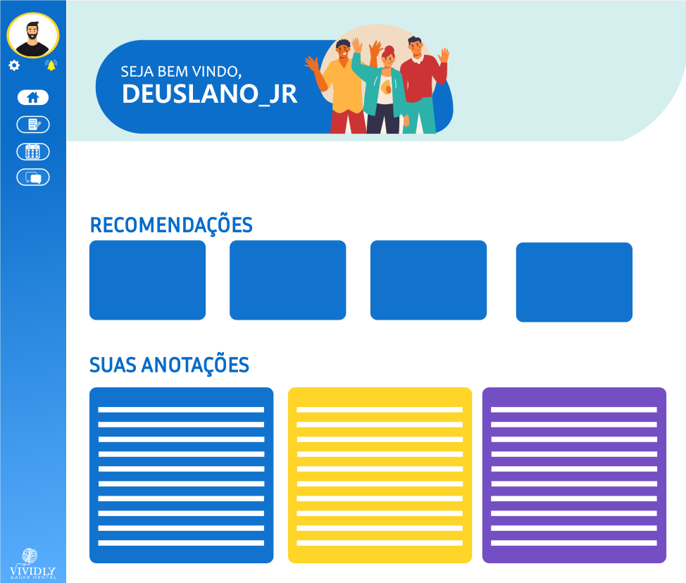
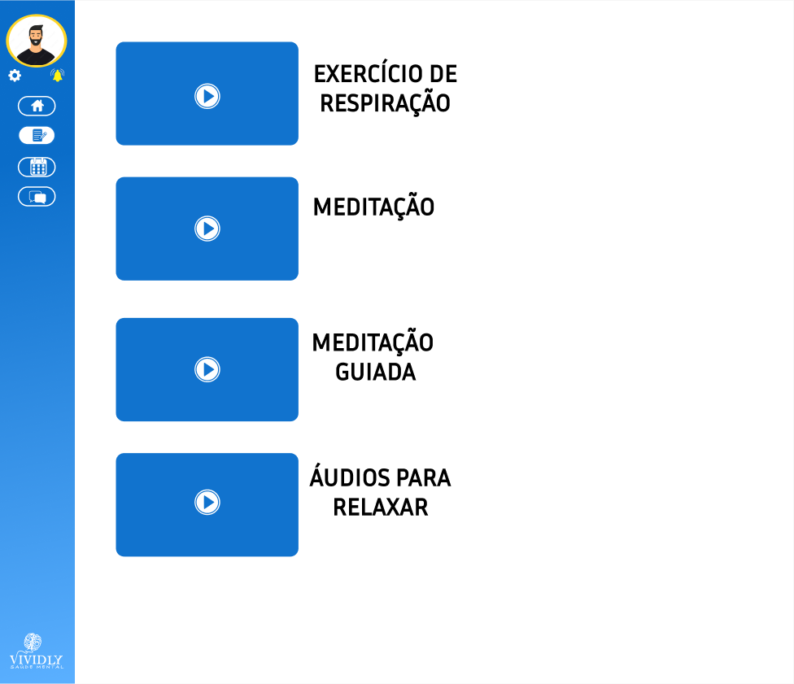
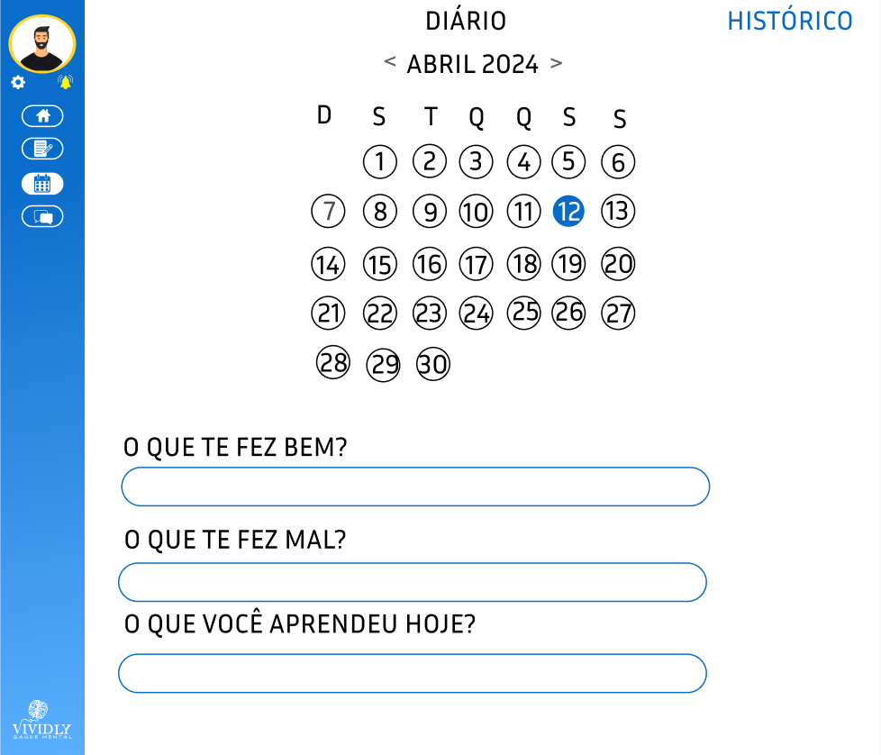
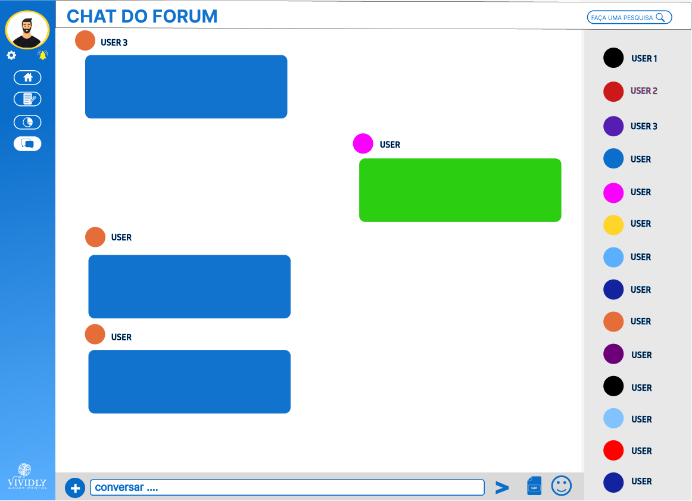

# Projeto de Interface

## User Flow

O fluxograma apresentado na figura 1 mostra o fluxo de interação do usuário pelas telas do sistema. Cada uma das telas deste fluxo é detalhada na seção de Protótipo de baixa fidelidade que se segue. Para visualizar o protótipo interativo, acesse o 

<figure>
    
    <figcaption>Imagem - Tela de início
    </figcaption>
</figure> 

## Protótipo

Desenvolver um protótipo emerge como uma das maneiras mais ágeis e econômicas de validar uma ideia, conceito ou funcionalidade. Isso permite a interação, avaliação, modificação e aprovação das principais características de uma interface antes de entrar na fase de desenvolvimento. Leia o artigo [Protótipos: baixa, média ou alta fidelidade?](https://medium.com/ladies-that-ux-br/prot%C3%B3tipos-baixa-m%C3%A9dia-ou-alta-fidelidade-71d897559135).

### Protótipo de baixa fidelidade

<figure>
    
    <figcaption>Imagem 8 - Tela de início
    </figcaption>
</figure> 

## Tela - Home page

A tela home page é o primeiro contato do usuário com o site. Apresenta também infromações sobre o site, e direciona para o login ou cadastro.

<!-- [Elabore as principais interfaces gráficas da aplicação de modo que os requisitos funcionais sejam contemplados nas telas propostas.]

[Adicione aqui as telas da sua aplicação com seus devidos títulos.] 
 
> **Links Úteis**:
> - [Protótipos vs Wireframes](https://www.nngroup.com/videos/prototypes-vs-wireframes-ux-projects/)
>- Ferramentas:
>> - [Pencil](https://pencil.evolus.vn/)
>> - [MarvelApp](https://marvelapp.com/)
>> - [Figma](https://www.figma.com/) -->
<figure>
    
    <figcaption>Imagem 1 - Tela de início
    </figcaption>
</figure>

## Tela - Login

A tela de Login apresenta campos para serem preenchidos, com email e senha, com a finalidade de conceder acesso ao usuário à sua respectiva conta. Ademais, contém uma ferramenta que mantém salvo o login da pessoa.
<figure>
    
    <figcaption>Imagem 2 - Tela de login
    </figcaption>
</figure>

## Tela - Cadastro

A tela de cadastro apresenta um formulário, para a inserção de informações do usuário, com o intuito de criar um login para o acesso a plataforma. Sendo as informções: Nome Completo, Nome de Usuário, Email, Telefone e Senha.

<figure>
    
    <figcaption>Imagem 3 - Tela de cadastro
    </figcaption>
</figure>

## Tela - Dashboard

A tela dashboard apresenta as recomendações e anotações do usuário na plataforma. Além disso, a partir dela, ele consegue acessar as demais páginas pelos ícones na sidebar à esquerda.

<figure>
    
    <figcaption>Imagem 4 - Tela de dashboard
    </figcaption>
</figure>

## Tela - Exercício 

A tela de exercício apresenta os exercícios a serem utilizados.

<figure>
    
    <figcaption>Imagem 5 - Tela de exercícios
    </figcaption>
</figure>

## Tela - Diário

A tela diário apresenta um caléndario e três perguntas referentes ao dia do usuário.

<figure>
    
    <figcaption>Imagem 6 - Tela de diário
    </figcaption>
</figure>

## Tela - Fórum 

A tela fórum apresenta um chat de bate-papo online entre os users.

<figure>
    
    <figcaption>Imagem 7 - Tela do fórum
    </figcaption>
</figure>

