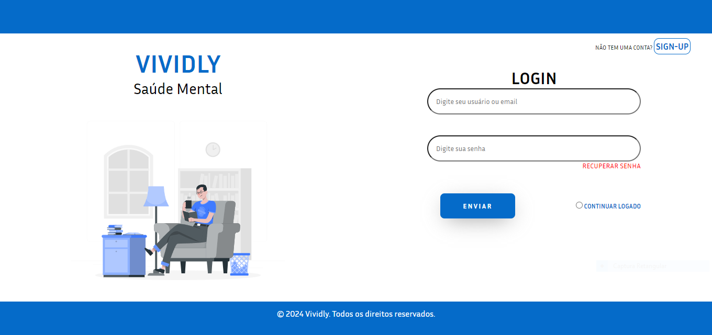
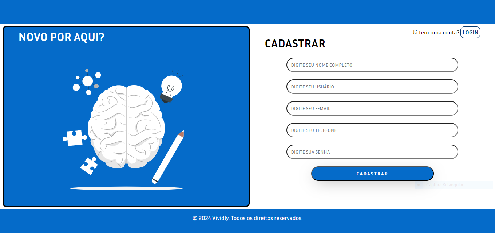
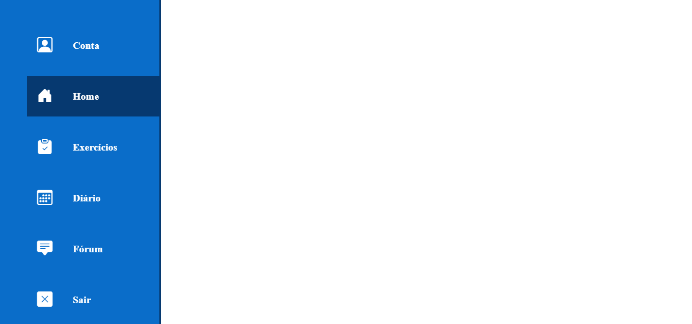
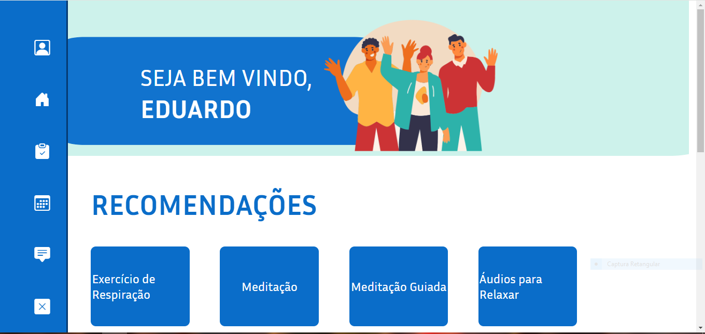
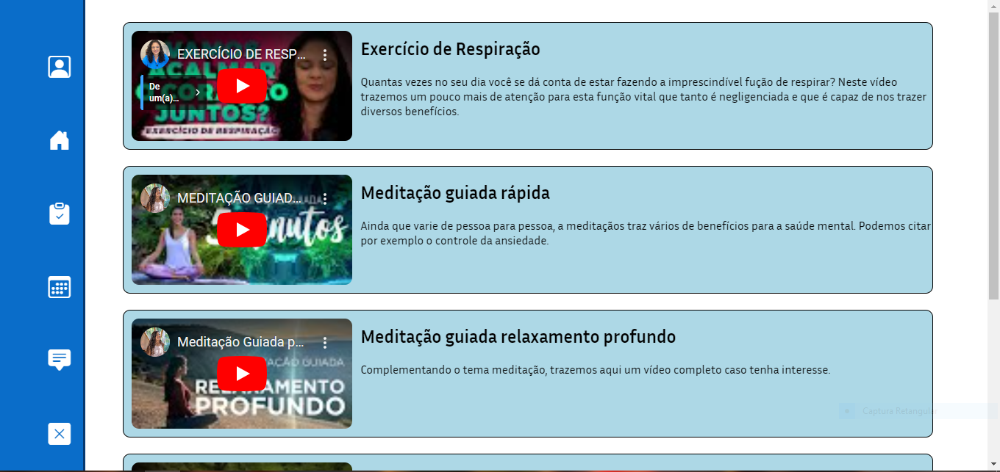
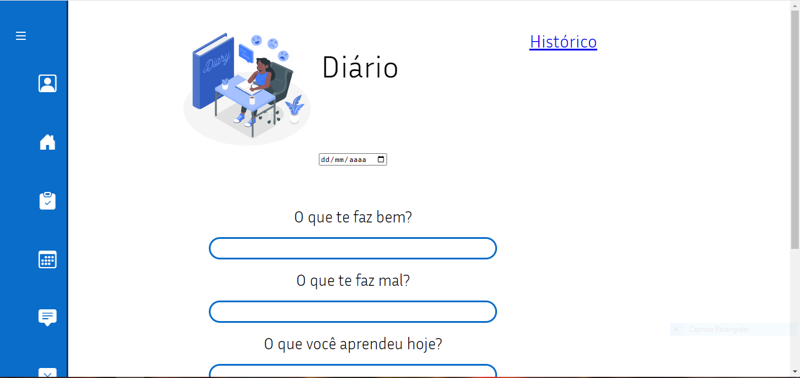

# Template padrão da Aplicação

O layout padrão do site foi construído com as linguagens de marcação HTML e CSS, e a linguagem de programação JavaScript foi utilizada para a construção do menu responsivo.

As páginas terão como elementos padrões o menu de navegação, o header e o footer, além dos elementos de identidade visual citados abaixo:

<ul>
<li>Cores: RGB: #1e81b0, #063970, white , blue;</li>
<li>Font-family: Inria Sans, sans-serif.</li>
<li>Font-size: 20px e 28px. </li>
</ul>
  
O código utilizado para a construção dos elementos citados, incluindo a responsividade, pode ser consultado <a href="../codigo-fonte/">aqui</a>.
As imagens e ícones utilizados no projeto estão disponíveis <a href="../codigo-fonte/Imagens/">aqui</a>.

Para a criação do logotipo do site foi utilizada a cor azul e branco , pois esta cor remete  calma, tranquilidade e comunicação clara.

<h3><b>Logotipo<b><h3>

<figure>
    
    <figcaption> Imagem 1 - Logotipo da Vividly</figcaption>
</figure> 

<h3><b>Tela inicial<b><h3>

Nossa tela incial possui um header e um footer na cor azul #056BC9. Este padrão se repetirá em outras telas.

<figure>
    
    <figcaption> Imagem 2 - Tela Inicial</figcaption>
</figure> 

<h3><b>Telas login e cadastro<b><h3>

As telas login e cadastro seguem a mesma idéia da tela incial, com um header e um footer no tom azul #056BC9, que se repete em outras partes das páginas.

<figure>
    
    <figcaption> Imagem 3 - Tela Login</figcaption>
</figure> 

<figure>
    
    <figcaption> Imagem 3 - Tela cadastro</figcaption>
</figure>

<h3><b>Navegação<b><h3>

A navegação pelo site é realizada através de um menu localizado na lateral esquerda do site. Este padrão se repete para todas as telas dentro da aplicação.

<figure>
    
    <figcaption> Imagem 4 - Tela Menu</figcaption>
</figure> 

Quando o cursosr não está sobre, o menu é reduzido e se apresenta na forma de ícones.

<figure>
    
    <figcaption> Imagem 5 - Tela Home</figcaption>
</figure>

<figure>
    
    <figcaption> Imagem 6 - Tela Exercícios</figcaption>
</figure>

<figure>
    
    <figcaption> Imagem 7 - Tela Diário</figcaption>
</figure>

